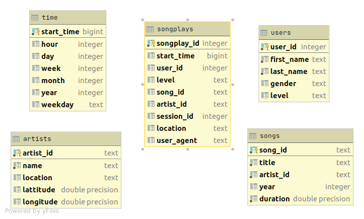

# Sparkify Postgres ETL

This project consists 
- sql_queries.py : which is used for hold all needed queries for table creation - insert data 
- etl.py which used to load data from json files into the database

## Project Summary

The objective of this project is to create a SQL analytics database for a fictional music streaming service called Sparkify. 
Sparkify's analytics team seeks to understand what, when and how users are playing songs on the company's music app. The analysts need an easy way to query and analyze the data, which is currently locally stored in raw JSON logs on user activity on the app, as well as a directory with JSON metadata on the songs in their app on.

## Database Schema

Star Schema: 
There is one main fact table containing all the measures associated with each event *songplays*, 
and 4-dimensional tables *songs*, *artists*, *users* and *time*, each with a primary key that is being referenced from the fact table.

## How to Use

1. Run create_tables.py from terminal to set up the database and tables.
2. Run etl.py from terminal to process and load data into the database.
3. Launch test.ipynb to run validation and example queries.

